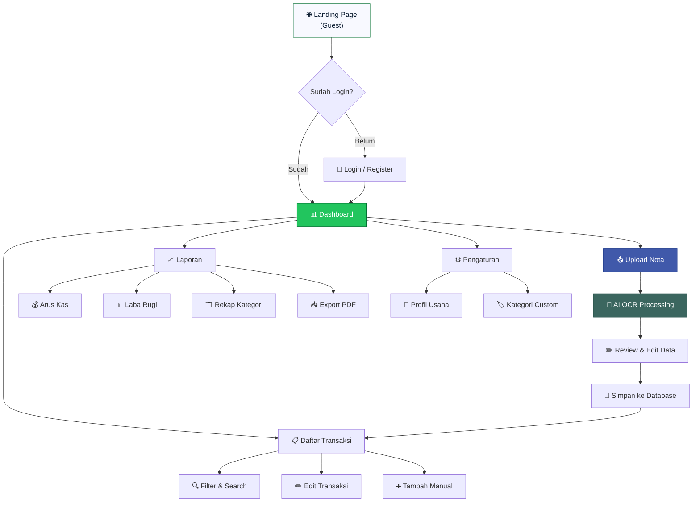
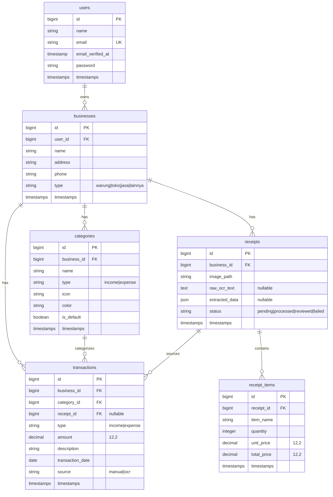

# CashMate — Evaluasi & Implementation Plan Lengkap

> **Tanggal:** 15 Mei 2026 · **Stack:** Laravel 12 + Tailwind v3 (CDN) + Breeze v2 · **DB:** MySQL (`cashmate`)

---

## 🔍 Evaluasi Current State

### Apa yang Sudah Ada

| Komponen | Status | Detail |
|---|---|---|
| Laravel 12 + Breeze | ✅ Terinstall | Auth scaffolding ada di `resources/views/auth/` |
| Landing Page | ✅ View ada | Statis, desain bagus (glassmorphism + Material Design 3) |
| Tentang Kami | ✅ View ada | Lengkap (hero, metrics, story, values, team, partners) |
| Dashboard | ⚠️ Copy landing | Isi **identik** dengan `landing_page.blade.php` — belum ada dashboard sebenarnya |
| Upload | ⚠️ Copy landing | Isi **identik** dengan `landing_page.blade.php` — belum ada upload form |
| Login (root) | ⚠️ Copy landing | `login.blade.php` (root) = copy landing, bukan form login |
| Transaksi | ✅ View ada | UI mockup statis — sidebar + bubble chart + summary cards |
| Laporan | ✅ View ada | UI mockup statis — sidebar + report cards + chart placeholder |
| Auth (Breeze) | ✅ Fungsional | `auth/login.blade.php` & `auth/register.blade.php` dari Breeze |
| Controllers | ⚠️ Ada tapi kosong | 6 controller dibuat tapi **tidak terhubung ke routes** |
| Database | ❌ Kosong | Hanya migration `users`, `cache`, `jobs` (default Laravel) |
| Models | ❌ Hanya User | Tidak ada model bisnis (transaction, category, dll) |

### 12 Masalah Kritis yang Ditemukan

> [!CAUTION]
> Masalah-masalah ini **harus diselesaikan** sebelum website dapat digunakan.

| # | Masalah | Severity | Detail |
|---|---|---|---|
| 1 | **Views statis tanpa data** | 🔴 Critical | Semua halaman (dashboard, transaksi, laporan) berisi data hardcoded, bukan dari database |
| 2 | **Dashboard/Upload/Login = copy Landing** | 🔴 Critical | 3 file view identik dengan `landing_page.blade.php` — belum ada konten asli |
| 3 | **Tidak ada database schema bisnis** | 🔴 Critical | Belum ada tabel `transactions`, `categories`, `receipts`, `businesses` |
| 4 | **Routes duplikat** | ✅ Fixed | Dibersihkan dari `web.php` & `auth.php` |
| 5 | **Controllers tidak terpakai** | 🟡 Major | 6 controller dibuat tapi routes menggunakan closure, bukan controller |
| 6 | **Navigasi tidak terhubung** | ✅ Fixed | Semua link di `guest.blade.php` sudah terhubung |
| 7 | **CDN Tailwind bukan Vite** | 🟡 Major | Views menggunakan `cdn.tailwindcss.com` bukan Vite pipeline yang sudah terkonfigurasi |
| 8 | **Tailwind config duplikasi** | 🟡 Major | Setiap view memiliki `<script>tailwind.config</script>` sendiri (~170 baris per file) |
| 9 | **Tidak ada layout system** | ✅ Fixed | Menggunakan `app`, `guest`, dan `auth` layouts |
| 10 | **Controller naming convention** | 🟠 Minor | Controller menggunakan lowercase (`tentangkami.php`, `dashboard.php`) bukan PascalCase |
| 11 | **Tidak ada middleware protection** | ✅ Fixed | Middleware `auth` & `verified` sudah diterapkan & ditest |
| 12 | **Tidak ada CSRF/form handling** | 🟠 Minor | Semua button/form hanya UI, tidak ada POST action |

---

## 🗺️ App Flow (User Journey)



---

## 🗄️ Database Schema

### Entity Relationship Diagram



### Migration Files yang Perlu Dibuat

| Migration | Tabel | Keterangan |
|---|---|---|
| `create_businesses_table` | `businesses` | Profil usaha per user |
| `create_categories_table` | `categories` | Kategori transaksi (default + custom) |
| `create_receipts_table` | `receipts` | Foto nota yang diupload |
| `create_receipt_items_table` | `receipt_items` | Item per nota (hasil OCR) |
| `create_transactions_table` | `transactions` | Transaksi keuangan utama |

---

## 🏗️ Backend Architecture

### Models & Relationships

| Model | Relationships | Factory/Seeder |
|---|---|---|
| `User` | `hasMany(Business)` | ✅ Ada (Breeze) |
| `Business` | `belongsTo(User)`, `hasMany(Transaction, Category, Receipt)` | 🔨 Buat baru |
| `Category` | `belongsTo(Business)`, `hasMany(Transaction)` | 🔨 Buat baru + seeder defaults |
| `Transaction` | `belongsTo(Business, Category, Receipt)` | 🔨 Buat baru |
| `Receipt` | `belongsTo(Business)`, `hasMany(ReceiptItem)`, `hasMany(Transaction)` | 🔨 Buat baru |
| `ReceiptItem` | `belongsTo(Receipt)` | 🔨 Buat baru |

### Controllers

| Controller | Route Group | Methods | Auth |
|---|---|---|---|
| `LandingPageController` | `/` | `index` | Guest |
| `TentangKamiController` | `/tentang-kami` | `index` | Guest |
| `DashboardController` | `/dashboard` | `index` | ✅ Auth |
| `UploadController` | `/upload` | `index`, `store`, `process` | ✅ Auth |
| `TransactionController` | `/transaksi` | `index`, `create`, `store`, `edit`, `update`, `destroy` | ✅ Auth |
| `ReportController` | `/laporan` | `index`, `arusKas`, `labaRugi`, `rekapKategori`, `exportPdf` | ✅ Auth |
| `ReviewController` | `/review` | `show`, `approve` | ✅ Auth |
| `SettingController` | `/pengaturan` | `index`, `updateProfil`, `kategori` | ✅ Auth |

### Services

| Service | Responsibility |
|---|---|
| `OcrService` | Integrasi Google AI Studio API — kirim gambar, terima JSON data transaksi |
| `ReportService` | Hitung arus kas, laba rugi, rekap kategori per periode |
| `DashboardService` | Hitung summary cards, chart data, recent transactions |

### Form Requests (Validation)

| Request | Fields |
|---|---|
| `StoreTransactionRequest` | `type`, `amount`, `category_id`, `description`, `transaction_date` |
| `UpdateTransactionRequest` | Same as Store |
| `UploadReceiptRequest` | `image` (mimes:jpg,png,jpeg, max:5MB) |
| `UpdateBusinessRequest` | `name`, `address`, `phone`, `type` |
| `ApproveReceiptRequest` | `items[]` (array of extracted items to save) |

---

## 🎨 Frontend Architecture

### Layout System

```
resources/views/
├── layouts/
│   ├── app.blade.php          ← AppLayout (sidebar + topbar) untuk halaman authenticated
│   └── guest.blade.php        ← GuestLayout (navbar + footer) untuk landing/auth
├── components/
│   ├── sidebar.blade.php      ← [NEW] Sidebar navigasi (reusable)
│   ├── topbar.blade.php       ← [NEW] Top app bar (reusable)
│   ├── stat-card.blade.php    ← [NEW] Widget statistik dashboard
│   ├── glass-card.blade.php   ← [EXISTS] Glass card component
│   ├── nav-link.blade.php     ← [EXISTS] Navigation link
│   └── ...                    ← Breeze components (tetap)
├── auth/
│   ├── login.blade.php        ← [REDESIGN] Custom glassmorphism login
│   └── register.blade.php     ← [REDESIGN] Custom glassmorphism register
├── landing_page.blade.php     ← [REFACTOR] Pindah ke guest layout
├── tentangkami.blade.php      ← [REFACTOR] Pindah ke guest layout
├── dashboard.blade.php        ← [REBUILD] Dashboard dengan data real
├── upload.blade.php           ← [REBUILD] Upload form + drag-drop + camera
├── review.blade.php           ← [NEW] Halaman review hasil OCR
├── transaksi.blade.php        ← [REFACTOR] Koneksi ke data real
├── laporan.blade.php          ← [REFACTOR] Koneksi ke data real
└── pengaturan.blade.php       ← [NEW] Halaman settings
```

### Konsolidasi Design System

> [!IMPORTANT]
> Semua Tailwind config yang saat ini di-inline di setiap view (~170 baris per file) harus dipindahkan ke satu file `tailwind.config.js` yang sudah ada, dan semua view harus menggunakan Vite pipeline (`@vite`) bukan CDN.

**Perubahan:**
1. Pindahkan color palette + typography dari inline `<script>` ke `tailwind.config.js`
2. Ganti `<script src="cdn.tailwindcss.com">` → `@vite(['resources/css/app.css', 'resources/js/app.js'])`
3. Custom CSS utilities (`.glass-card`, `.glass-panel`, `.aurora-gradient`) → `resources/css/app.css`

### Key Frontend Dependencies

| Library | Kegunaan | Install |
|---|---|---|
| Chart.js | Grafik arus kas, laba rugi | `npm install chart.js` |
| Alpine.js | Interaktivitas ringan (sudah via Breeze) | ✅ Sudah ada |
| DomPDF | Export PDF server-side | `composer require barryvdh/laravel-dompdf` |

---

## 📋 Implementation Phases

### Phase 1: Foundation & Cleanup (Estimasi: 4-5 jam)

> Membersihkan technical debt dan membangun fondasi yang benar.

- [ ] Konsolidasi Tailwind config → `tailwind.config.js`
- [ ] Migrasi semua view dari CDN Tailwind → Vite pipeline (`@vite`)
- [ ] Pindahkan custom CSS ke `resources/css/app.css`
- [ ] Rebuild `layouts/app.blade.php` — sidebar + topbar (dari design transaksi/laporan)
- [ ] Rebuild `layouts/guest.blade.php` — navbar + footer (dari design landing)
- [ ] Buat komponen: `sidebar.blade.php`, `topbar.blade.php`, `stat-card.blade.php`
- [ ] Fix duplicate routes di `web.php`
- [ ] Rename controllers ke PascalCase convention
- [ ] Hapus file view duplikat (`login.blade.php` root, `upload.blade.php` copy)

---

### Phase 2: Authentication & Landing Page (Estimasi: 3-4 jam)

> Auth berfungsi penuh + Landing page terhubung.

- [x] Redesign `auth/login.blade.php` → glassmorphism sesuai design system
- [x] Redesign `auth/register.blade.php` → glassmorphism sesuai design system
- [x] Refactor `landing_page.blade.php` → gunakan `guest` layout
- [x] Refactor `tentangkami.blade.php` → gunakan `guest` layout
- [x] Hubungkan semua navigasi link (Fitur, Tentang Kami, Masuk, Mulai Gratis)
- [x] Pastikan middleware: guest pages accessible, auth pages protected

---

### Phase 3: Database & Dashboard (Estimasi: 5-6 jam)

> Schema database lengkap + Dashboard fungsional dengan data real.

- [ ] Buat migration: `businesses`, `categories`, `receipts`, `receipt_items`, `transactions`
- [ ] Buat model: `Business`, `Category`, `Transaction`, `Receipt`, `ReceiptItem`
- [ ] Buat factory + seeder untuk data demo
- [ ] Seeder kategori default (Bahan Baku, Operasional, Gaji, Transportasi, dll)
- [ ] Buat `DashboardController` dengan query summary
- [ ] Rebuild `dashboard.blade.php`:
  - Stat cards (total pemasukan, pengeluaran, saldo)
  - Chart.js bar chart arus kas
  - 5 transaksi terbaru
  - Quick action buttons
- [ ] Buat `DashboardService` untuk aggregasi data
- [ ] Auto-create business profile setelah register

---

### Phase 4: Upload & OCR (Estimasi: 5-6 jam)

> Fitur inti — upload nota dan proses dengan AI.

- [ ] Rebuild `upload.blade.php`:
  - Drag & drop zone
  - Camera capture (mobile)
  - Upload history list
- [ ] Buat `UploadController` + `UploadReceiptRequest`
- [ ] Buat `OcrService` — integrasi Google AI Studio / Gemini Vision API
- [ ] Buat `review.blade.php` — tampilkan hasil OCR editable
- [ ] Buat `ReviewController` — approve & save ke transactions
- [ ] Processing overlay (loading + progress)
- [ ] Store uploaded images ke `storage/app/receipts`

---

### Phase 5: Transaksi & Review (Estimasi: 4-5 jam)

> CRUD transaksi lengkap + filter/search.

- [ ] Refactor `transaksi.blade.php` → koneksi data real
- [ ] Buat `TransactionController` (full resource)
- [ ] Form tambah transaksi manual
- [ ] Edit & hapus transaksi
- [ ] Filter: tanggal, kategori, tipe (income/expense)
- [ ] Search transaksi
- [ ] Pagination
- [ ] Bubble chart visualization dengan data real

---

### Phase 6: Laporan & Settings (Estimasi: 4-5 jam)

> Laporan keuangan + export + pengaturan.

- [ ] Refactor `laporan.blade.php` → koneksi data real
- [ ] Buat `ReportController` + `ReportService`
- [ ] Laporan Arus Kas (chart + tabel)
- [ ] Laporan Laba Rugi (tabel income vs expense)
- [ ] Rekap Kategori (pie chart + breakdown)
- [ ] Export PDF (DomPDF)
- [ ] Buat `pengaturan.blade.php`:
  - Form profil usaha
  - Manage kategori custom
- [ ] Buat `SettingController`

---

## ✅ Verification Plan

### Automated Tests (Pest)
```bash
php artisan test --compact --filter=AuthTest       # Register + Login + Logout
php artisan test --compact --filter=DashboardTest   # Access dashboard with data
php artisan test --compact --filter=TransactionTest # CRUD transaksi
php artisan test --compact --filter=UploadTest      # Upload file + validation
php artisan test --compact --filter=ReportTest      # Generate report data
```

### Manual Verification
- Visual QA di Chrome desktop + mobile viewport
- Test upload foto nota asli
- Verify PDF export output
- Test semua navigasi link berfungsi
- Test responsive sidebar collapse

---

## ❓ Open Questions

> [!IMPORTANT]
> **Pertanyaan berikut perlu dijawab sebelum memulai implementasi:**

1. ~~**Google AI Studio API Key:** Apakah sudah punya API key untuk OCR?~~ ✅ *(Sudah ditambahkan, `OcrService` telah dibuat)*

2. ~~**Chart Library:** Plan ini menggunakan **Chart.js**. Ada preferensi lain?~~ ✅ *(Dikonfirmasi menggunakan Chart.js)*

3. ~~**PDF Export:** Plan ini menggunakan **DomPDF** (`barryvdh/laravel-dompdf`). Apakah OK atau ada preferensi lain?~~ ✅ *(Dikonfirmasi menggunakan DomPDF)*

4. ~~**Bahasa UI:** Semua UI tetap **Bahasa Indonesia** penuh?~~ ✅ *(Dikonfirmasi)*

5. ~~**Kategori Default:** Berikut kategori yang akan di-seed sebagai default. Apakah ada yang perlu ditambah/ubah?~~ ✅ *(Dikonfirmasi, tidak ada perubahan)*
   - **Pengeluaran:** Bahan Baku, Operasional, Gaji Karyawan, Transportasi, Sewa, Utilitas (Listrik/Air), Kemasan, Marketing, Lainnya
   - **Pemasukan:** Penjualan Produk, Penjualan Jasa, Pendapatan Lainnya

6. ~~**Prioritas Phase:** Apakah urutan phase di atas sudah sesuai? Atau ada phase yang ingin didahulukan?~~ ✅ *(Dikonfirmasi)*

7. **Deployment Target:** Apakah website ini akan dideploy (Laravel Cloud, VPS, shared hosting)? Ini mempengaruhi konfigurasi.
